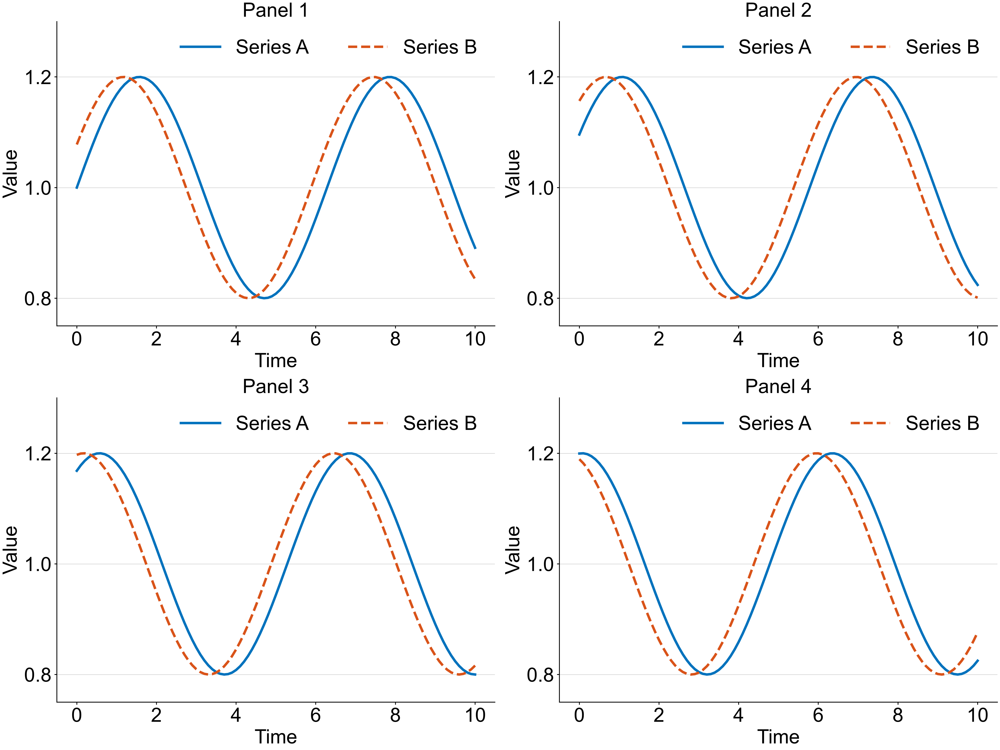
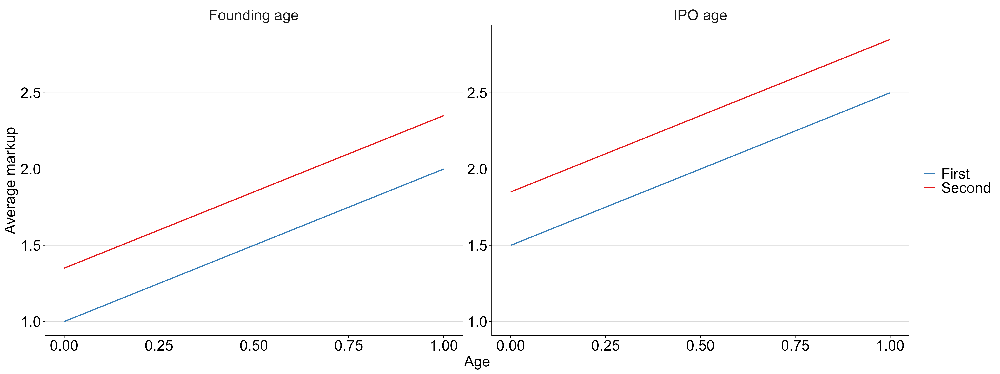

# Style figures

A reusable scientific figure template for MATLAB, Python with Matplotlib, and R with ggplot2. All three versions use Helvetica or Arial, ColorBrewer Set1 by default, outward ticks, horizontal grid lines and a white background. Every visible subplot shows x and y tick marks and tick labels, including panels with shared axes. An optional palette reproduces MATLAB's classic seven-color order.

The default font size is 24 points and the line width is 3 points. A single panel measures 8.5 by 6.375 inches. Multi-panel Python figures use that size per panel. Produce PNG at 300 dpi only, unless the user explicitly requests another format or resolution. Do not automatically create companion PDFs or other image formats. This rule applies to all three languages and to downstream plotting scripts.

This repository was previously named `mvazcar/matlab-figures`. It extends [Pascal Michaillat's MATLAB template](https://github.com/pmichaillat/matlab-figures). His design, attribution, original examples and MIT licence are retained.

## Use in Python

The default automatic colour order in all three languages is blue, red, green, purple, orange, yellow, brown, pink and grey. All nine colours are from ColorBrewer Set1. The cycle restarts at blue after the ninth series. Named colours such as `s.blue` and `s.red` keep their meanings.

For the classic MATLAB ColorOrder used from R2014b through R2024b, select `palette="matlab"` in Python or R, or pass `'matlab'` as the third MATLAB argument. The seven colours, in order, are blue `#0072BD`, orange `#D95319`, yellow `#EDB120`, purple `#7E2F8E`, green `#77AC30`, cyan `#4DBEEE`, and dark red `#A2142F`. The cycle repeats after seven series. MATLAB's [light-theme default changed slightly in R2025a](https://www.mathworks.com/help/matlab/ref/orderedcolors.html); this option deliberately reproduces the earlier palette for older replication code.

Install into your project's Python environment:

```sh
python -m pip install "git+https://github.com/mvazcar/style-figures.git"
```

Then call the template:

```python
from style_figures import figure_style, subplots, figure_print

s = figure_style()
fig, axes = subplots(1, 2, sharex=True, sharey=True)

for ax, title in zip(axes, ["Founding age", "IPO age"]):
    ax.plot([0, 1, 2], [1.2, 1.3, 1.4], color=s.blue)
    ax.set(title=title, xlabel="Age", ylabel="Average markup")

figure_print("comparison.png", fig)
```

Use `subplots()` in place of `matplotlib.pyplot.subplots()` to show both sets of tick labels immediately. It accepts Matplotlib's layout and sharing arguments. `figure_print()` also restores labels before saving, so it works with figures created through ordinary Matplotlib calls. For an existing on-screen figure, call `figure_ticks(fig)` after plotting and before `plt.show()`.

Tick locations, custom text labels, percentage or date formatters, limits, data and shared-axis links stay unchanged. Python treats explicitly empty tick locations or formatters as deliberate overrides. Panels hidden with `axis('off')`, colourbars, polar axes and 3D axes are excluded. The template targets ordinary Cartesian scientific plots.

`figure_style()` changes defaults for subsequently created artists. To limit its scope, call it inside `with matplotlib.rc_context():`. For custom sizes, use `figure_style(font_size=18, line_width=2)` and `subplots(..., figsize=(12, 5))`. Use `figure_style(palette="matlab")` to switch colour order.

`figure_print('comparison')` adds `.png` and saves at 300 dpi. `figure_style()` also sets ordinary Matplotlib exports to PNG at 300 dpi, overriding inherited export defaults. Use an explicit `.pdf` suffix only when the user requests a PDF. Exports use the figure's dimensions in inches; pass `bbox_inches='tight'` only when you want cropping to change those dimensions.

## Use in MATLAB

Clone the repository and add its folder to the MATLAB path:

```matlab
addpath('C:/path/to/style-figures')
s = figure_style();

fig = figure;
tiledlayout(1, 2, 'TileSpacing', 'loose');
for panel = 1:2
    ax = nexttile;
    plot(ax, 0:2, [1.2 1.3 1.4], 'Color', s.blue);
    xlabel(ax, 'Age'); ylabel(ax, 'Average markup');
end
figure_ticks(fig);                  % Both axes visible on screen
figure_print('comparison.png', fig); % Also restores ticks before export
```

Keep the folder on your MATLAB path, or copy `figure_style.m`, `figure_ticks.m` and `figure_print.m` together into a project. Call `figure_style()` at the top of each plotting script. The defaults last for the MATLAB session.
To use the classic MATLAB colour order, call `figure_style(24, 3, 'matlab')`.

`figure_ticks()` visits every visible subplot. It restores empty tick positions and labels to automatic values, while preserving non-empty custom positions and labels. Hidden axes remain hidden. It does not change the plotted data or axis limits.

For figures larger than your display, draw at a fraction of the intended sheet size, scaling fonts and lines by the same fraction:

```matlab
sheet = [17 12.75]; scale = 0.5;
figure_style(24*scale, 3*scale);
fig = figure('Position', [1 1 sheet*scale]);
% Add your panels here.
figure_print('panels.png', fig, 300, sheet);
figure_style();
```

## Use in R

Install `ggplot2`, `systemfonts` and `ragg`, then source the theme file:

```r
source("R/figure_style.R")
s <- figure_style()

p <- ggplot2::ggplot(data.frame(x = 1:4, y = c(2, 3, 2.5, 4)),
                     ggplot2::aes(x, y)) +
  ggplot2::geom_line(colour = s$blue, linewidth = s$width_mm) +
  theme_style_figures()
figure_print(p, "example.png")
```

`figure_style()` returns named colours, font and line-width settings. The `width` value is in points; use `width_mm` for ggplot2's line-width argument. Use `scale_colour_style_figures()` or `scale_fill_style_figures()` for multiple series. Pass `palette = "matlab"` to these helpers, `figure_style()`, and `theme_style_figures()` to use the seven-colour order. For facets, use `facet_wrap_style_figures()` or `facet_grid_style_figures()` so every panel has bottom and left tick labels. The wrappers require ggplot2 3.5 or newer. Adjust font and line width for a different sheet size with `theme_style_figures(font_size = 18, line_width = 2)` and matching `figure_style(18, 2)`. `figure_print()` saves one 8.5 by 6.375 inch PNG at 300 dpi by default; pass `width` and `height` for a slide-sized plot.

## Font requirement

All three versions select Helvetica if installed, otherwise Arial. They raise an error if neither is installed. They do not silently substitute another family. The selected name is returned as `s.font_name` in Python and MATLAB and `s$font_name` in R.

Install Helvetica or Arial before using the template. Python can register a licensed font file for the current process with `matplotlib.font_manager.fontManager.addfont(path)` before calling `figure_style()`. Python's built-in mathematical text also uses the selected family. External LaTeX rendering has its own fonts and is outside this template's font guarantee; leave `text.usetex` off in Python and do not select MATLAB's `latex` interpreter.

## Examples

The Python and MATLAB examples use the same deterministic curves and a 2-by-2 layout. Every panel has both sets of tick labels. The R example demonstrates ggplot2 facets with visible axes on both panels.

```sh
python examples/python_panels.py
```

```matlab
run('examples/matlab_panels.m')
```

```sh
Rscript examples/r_panels.R
```





Run `figures.m` to reproduce the 12 original MATLAB illustrations. Their random data now use a fixed seed. The older `figures.pdf` and `figures.key` are retained as historical design references; they are not regenerated by the current examples.

## Development and reproducibility

Python requires version 3.10 or later and Matplotlib 3.8 or later within major version 3. MATLAB checks run on R2024b. R requires ggplot2 3.5 or later, systemfonts and ragg. CI tests all three languages on Windows, where Arial is installed. Use a commit SHA when installing from GitHub to pin a research project's template version.

```sh
python -m pip install -e ".[dev]"
python -m pytest -q
python -m ruff check src tests/python examples/python_panels.py
python -m build
```

```matlab
results = runtests('tests/matlab');
assertSuccess(results)
```

```sh
Rscript tests/r/test_figure_style.R
```

The tests render figures and check tick visibility, shared-axis behaviour, preservation of custom labels, exported pixel dimensions, font selection and missing-font errors. Source text matching is not used as evidence that figures work.

## Credits and licence

The original proportions, typography, grids and minimalist design are [Pascal Michaillat's](https://pascalmichaillat.org/d/). This extension adds the Set1 default palette, reusable helpers, ticks on every subplot, and the Matplotlib and ggplot2 implementations. The repository uses the [MIT licence](LICENSE.md).
